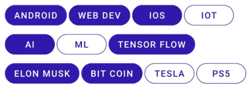

# Selectable Items Adapter


Recently I came across a ui design that we needed to implement in our App. The design looked something like the image above. Seems a simple design using a `Recycler View` and Google's `Flexbox layout manager`. But There was more to it.

You see , in terms of selection, there can be many decisions to choose from:  
1. **min-0 | single select** : the user should be able to select no item or at most 1 item. pressing the item again is going to mark item as unselected and thus the list could have 0 selections at a time

2. **min-0 | multi select** : the user should be able to select 0 or more items. pressing the item again is going to mark item as unselected and thus the list could have 0 selections at a time

3. **MIN-1 | SINGLE-SELECT** : The user should be able to select at-most 1 item. clicking the other items is going to change user selection to other item, but clicking same item will not have any effect. list should have 1 item as selected by default and thus the list will always have only 1 item as selected

4. **MIN-1 | MULTI-SELECT** : the user should be able to select 1 or more items. list should have 1 item as selected by default and pressing the item again is going to mark item as unselected  ONLY IF there is more than 1 selections in the list and thus the list will always have at least 1 or more items

## Problem statement.

So these are some of the various things to keep in mind while making a selectable item adapter. The problems that i was dealing with, had 2 such uis in which one ui required single selection (min-0) and one required multiple selections(min-0). The solution described below is for these cases only, but could also be easily converted to support all 4 selection cases.

## Solution.

In terms of Android and Recycler view, this is achieved by keeping a model which has a boolean for each item, like this:  

```kotlin
data class SelectableItem(val data:Interest, var isSelected:Boolean = false)
data class Interest(val  title:String)
```

For viewholder, this was again a simple code as the data clearly defines which ui to show for which state of the item :  

```kotlin
class SelectableVH(v:View) : RecyclerView.ViewHolder(v) {

    constructor(parent:ViewGroup, type:Int):this(
        LayoutInflater.from(parent.context).inflate(R.layout.item_tag,parent,false)
    )

    fun bindData(item: SelectableItem){
        with(itemView){
            val btTag = findViewById<MaterialButton>(R.id.btTag)
             btTag.text = item.data.title

            if(item.isSelected){
                btTag.backgroundTintList = ContextCompat.getColorStateList(context,R.color.purple_700)
                btTag.setTextColor(ContextCompat.getColor(context,R.color.white))
            }
            else{
                btTag.backgroundTintList = ContextCompat.getColorStateList(context,R.color.white)
                btTag.setTextColor(ContextCompat.getColor(context,R.color.purple_700))
                btTag.strokeColor = ContextCompat.getColorStateList(context,R.color.purple_700)
            }

        }
    }
}

```

The interesting part comes in the adapter. I know, the adapter is supposed to be simple and just do the task of inflating ui and attaching the data. But imagine having many of such recycler views in your screen. if you go with a simple adapter that just inflates the ui and attaches data via list on the ui, you will end up doing the following tasks in your activity :

1. changing the state of model for the clicked item. for eg, if user clicks an item `Elon Musk` in the list, you need to set its `isSelected = true/false` based on its previous state
2. changing the state of other items based on the state of currently clicked item . For eg, if its a single selection adapter, you need to run a loop over all the items to mark them as unselected
3. maintaining a list of selectable items: for multi selection, you need to maintain a list of selected items

and although it would be a good thing to do, the cases of min-0/min-1 and  single/multi selection options are similar enough to be controlled via a single adapter. check this out:

```kotlin
class SelectableAdapter() :RecyclerView.Adapter<SelectableVH>() {

    override fun onCreateViewHolder(parent: ViewGroup, type: Int) = SelectableVH(parent,type)
    override fun getItemCount() = adapterItems.size

    var multiSelect = false
        set(value) { field = value;notifyDataSetChanged() }

    var onItemClick : ((SelectableItem) -> Unit)? = null
        set(value) { field = value;notifyDataSetChanged() }

    var adapterItems = mutableListOf<SelectableItem>()
        set(value) { field = value;notifyDataSetChanged() }

    var selectedItems = mutableListOf<SelectableItem>()
        set(value) { field = value;notifyDataSetChanged() }

    override fun onBindViewHolder(holder: SelectableVH, position: Int) {
        holder.bindData(adapterItems[position])
        updateSelectedItemsList()
        holder.itemView.setOnClickListener { performOnClickActions(adapterItems[position]) }

    }

    fun performOnClickActions(item: SelectableItem) {
        val index = adapterItems.indexOfFirst { it.data.title == item.data.title}
        if (index != -1) {
            toggleSelection(index)
            updateSelectedItemsList()
            onItemClick?.invoke(item)
            notifyDataSetChanged()

        }
    }

    private fun toggleSelection(position: Int) {
        // will set tag as either selected or unselected .
        if (!multiSelect) {
            adapterItems.forEachIndexed { index, _ ->
                if(index!= position) (adapterItems[index]).isSelected = false
            }
        }
        val isPreviouslySelected =adapterItems[position].isSelected
        (adapterItems[position]).isSelected = !isPreviouslySelected

    }

    private fun updateSelectedItemsList() {
        selectedItems.clear()
        adapterItems.forEach { if (it.isSelected) selectedItems.add(it) }
    }
}

```

Lets try to understand it line by line

1. `onCreateViewHolder` ,`getItemCount` , `onBindViewHolder` are your normal overridden functions the adapter is controlled by `adapterItems`, a mutable list of Items. It is interesting to note the implementation of `itemClick` in `onBindViewHolder`. Usually if the adapter parent is providing a listener (as in this case too), we just directly attach it to view on-click, But here we are instead calling a custom public function `performOnClickActions` to perform `onItemClick?.invoke(item)` **After** performing various actions.    

2. This is because we don't want the caller adapter parent to end up performing selections and creating a convenient plug-and-play adapter that handles the clicks on its own. So checking onto the `performOnClickActions` , its calling another function `toggleSelection` followed by `updateSelectedItemsList` and then ultimately invoking the user click listener  

3. the `toggleSelection` is a very interesting function as it sets every item as selected and unselected based on the behavior we expect from the adapter:  
        a. If the adapter is multi selection, its just going to set that particular item as selected/unselected, giving us a simple min-0 multi select adapter  
        b. if the adapter is single selection, its going to run through a loop ,making all items as unselected and then updating the state of clicked item, giving us a cool little min-0 single select adapter  


4. the last call to `updateSelectedItemsList()` is simply to update the state of selectable items list . 

5. So since the adapter is handling all the complications of dealing with single/multi selections, we need to invoke the onclick AFTER the adapter is done updating the internal list. But why is `performOnClickActions` kept as public ? Because it  could be then used for making clicks via code.


--- 

So that was all in this mini problem statement . Please drop a 👏 if you find this useful . Connect with me on [My social links](https://root-ansh.github.io/notes/)  to discuss anything, android or otherwise. Thank you for reading!

